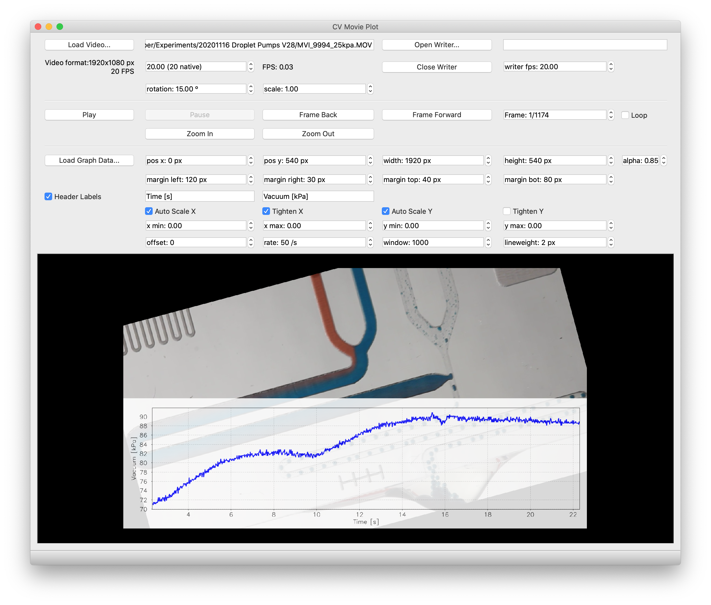

# CV Movie Plot
A simple Qt application that draws a graph overlay on a video file.

Supports:
* Vdeo scaling and rotation
* Graph size, position, opacity

Expects CSV data in the format: x,y \n.
Header data is optional and used to name axes.

# Requires
* [OpenCV](https://opencv.org)
* [CvPlot](https://github.com/Profactor/cv-plot)

# See Also
[CvPlotQt](https://github.com/Profactor/cv-plot-qt)
